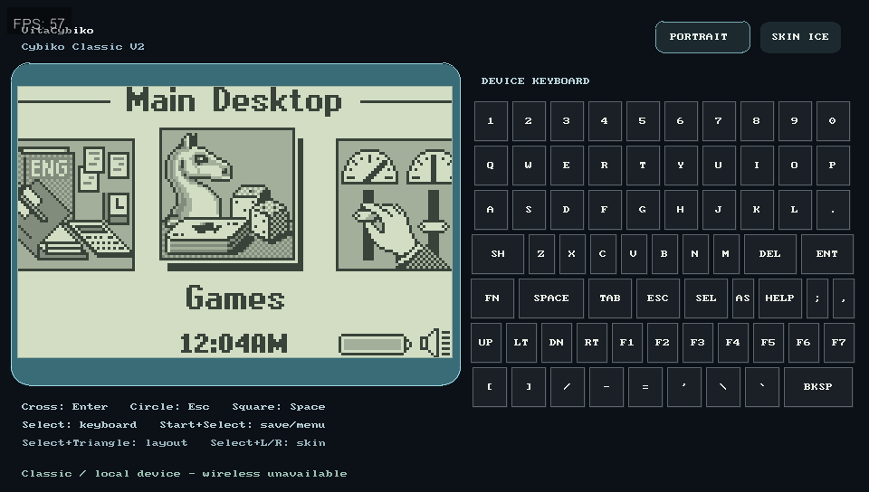

# VitaCybiko

Cybiko handheld emulation for PlayStation Vita/PSTV, with selectable **Classic V1, Classic V2 and Xtreme** profiles.

**Classic V2 boots to its real desktop and runs Pinball Pro in Windows Vita3K.**
Classic V1 now reaches its stock desktop and Xtreme reaches first-run setup when
matching firmware is supplied, but they are not yet app-by-app verified and are
slower than Classic V2. This is a **preview**, not complete 1:1 hardware
emulation.

Current package work is **01.19 preview**. It adds structural validation for
Classic serial-flash saves, a commit manifest binding flash/SRAM/RTC checkpoint
files, direct validation/replay of Vita checkpoint sidecars, and corrected
LiveArea version artwork. It retains the 01.18 execution fixes and performance
telemetry. It is still **not 60 FPS qualified** across all firmware/apps.
See the [optimization workbench and remaining gates](goals/OPTIMIZATION.md).

[Download the VPK](https://github.com/TheGh0stShip/VitaCybiko/releases) · [Setup](docs/MODELS.md) · [Compatibility](docs/COMPATIBILITY.md) · [Test evidence](docs/VERIFICATION.md)



## Install

1. Install `VitaCybiko.vpk` using VitaShell, or Vita3K's **File → Install .zip, .vpk**.
2. Supply your own legally obtained firmware using the [model-specific file layout and Archive.org reference links](docs/MODELS.md). Firmware, commercial apps and user saves are **not** included.
3. Launch VitaCybiko and choose the matching model. C4PC's `emu_rom.bin`, `emu_cyos.bin`, and `emu_flash.bin` belong to **Classic V2**, not Xtreme.
4. Complete Cybiko's first-run setup. The bundled Classic applications come from your serial-flash image.

The upright landscape view has a 3× LCD and full touch keyboard. Portrait mode, shell colors, model selection and clock state are saved. The LiveArea icon depicts a literal Classic device; [artwork provenance](assets/README.md).

## Controls

| Vita control | Cybiko action |
| --- | --- |
| D-pad | Direction keys |
| Cross / Circle | Enter / Esc |
| Square / Triangle | Space / Del |
| L / R | Shift / Fn |
| Start | Tab |
| Select | Toggle keyboard navigation |
| Start + Select | Save and return to model selector |
| Select + Triangle | Switch landscape/portrait |
| Select + L or R | Change shell color |

Tap keys directly, including numbers, function keys and Backspace. Touch SH/FN latch modifiers; tap again to release. In keyboard-navigation mode the D-pad moves the highlight and Cross presses that key; Circle or Select leaves this mode. Layout and skin also have touch buttons.

Each model has independent saves. Autosave runs every minute, on focus/background transitions and clean exit. Focus loss pauses emulation and releases held keys. Sudden termination can lose changes since the last save. Back up saves before upgrades.

Classic keeps battery-backed SRAM in `ram.dat` as well as flash and RTC state;
`session.dat` binds those files into one validated checkpoint. Keep the complete
model folder together when backing up. Short Classic taps are held through the
guest's keyboard scan window. In Calculator, Esc once clears
and Esc twice exits; Pinball asks for quit confirmation.

## Build and test

Vita: install [VitaSDK](https://vitasdk.org/) with SDL2 and SDL2_gfx packages.

```sh
export VITASDK=/usr/local/vitasdk
export PATH="$VITASDK/bin:$PATH"
cmake -S . -B build-vita -DCMAKE_BUILD_TYPE=Release
cmake --build build-vita -j4
# build-vita/VitaCybiko.vpk
```

Host tests (Ubuntu packages: build-essential, cmake, pkg-config, libsdl2-dev, libsdl2-gfx-dev, python3):

```sh
env -u VITASDK cmake -S . -B build-host -DVITACYBIKO_FRONTEND_TESTS=ON
cmake --build build-host -j4
ctest --test-dir build-host --output-on-failure
python3 -m unittest discover -s tests -p 'test_*.py'
```

Before publishing or pushing release-candidate emulator changes, run the same
local gate used by the maintainer workflow:

```sh
scripts/release_gate.sh
```

That gate runs release host tests, focused H8S CPU tests, ASan/UBSan/leak tests,
Python tests and the Vita package build when VitaSDK/build-vita is available.
After pushing, the corresponding GitHub Actions run must complete successfully
before a VPK is treated as distributable.

The preferred maintainer path is the push-and-watch wrapper, which runs the
local gate, pushes the current commit, then waits for the exact GitHub Actions
run for that commit to finish successfully:

```sh
scripts/push_and_verify.sh
```

If this wrapper exits non-zero, the commit is not considered published for
release purposes, even if `git push` itself completed.

No firmware is needed for these tests. The host `cybiko-smoke` runner can also run legally supplied firmware; LCD activity alone is not evidence of a successful desktop boot.

## Known boundaries

- Classic V2 setup, desktop, Pinball gameplay/exit, Calculator arithmetic and Text Editor save/reopen were observed in Vita3K. Clock continuity survives restart. Not every bundled app has been tested.
- Classic V1 reaches the stock desktop in Vita3K. Xtreme reaches the first-run setup dialog in Vita3K, and the current host smoke reaches the expected Xtreme setup path with active LCD frames. App-by-app behavior and physical performance are not yet validated for those two profiles.
- Package `01.19` retains the IRQ, battery, audio, scheduling and semantic
  execution work from 01.18 and adds Classic CFS/checkpoint integrity checks.
  Package 01.18 corrected IRQ timing during CyOS task switches, enabled full
  Classic battery readings, removed audio gap injection, optimized timer
  synchronization and H8S semantic fast-path probing, moved periodic saves off
  the frame loop, logged per-window CPU fast-path counters in `performance.csv`,
  and fixed sanitizer-detected signed-overflow undefined behavior in H8S long
  INC/DEC/NEG semantics. It also fixed H8S semantic BHI/BLS branch conditions
  that previously broke the Xtreme smoke path. Physical Vita smoothness remains
  unverified after the latest optimization pass; frame interpolation remains
  presentation-side only, not proof of full-speed guest execution.
- The exact original retail Classic launch bundle remains unverified.
- Wireless chat/multiplayer, CyWIG, original PC synchronization and USB/MP3 accessories are not implemented end-to-end.
- CPU timing is approximate; some instructions/peripheral modes remain incomplete. Classic external app installation is not implemented.
- Classic saves receive page-checksum and file-structure validation before
  loading; `cybiko-validate-cfs` can inspect a local image without modifying it.

See the [release goals](docs/RELEASE-PLAN.md), not an implied promise of completed hardware equivalence.

## License

VitaCybiko's first-party code is licensed under the
[GNU General Public License v3.0 or later](LICENSE). The vendored portable core
and other dependencies retain their permissive upstream licenses; see the
[third-party notices](THIRD_PARTY_NOTICES.md) and the license files shipped in
the source tree and VPK.

Independent homebrew; not affiliated with Cybiko or Sony.

[](https://hits.sh/github.com/TheGh0stShip/VitaCybiko/)
