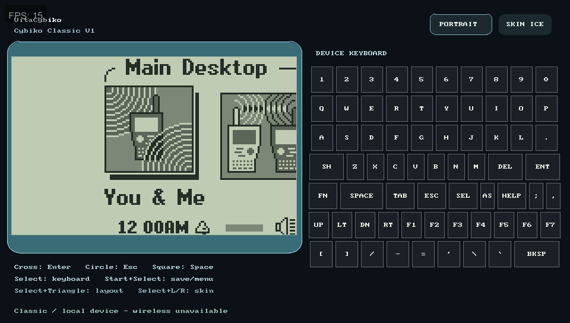
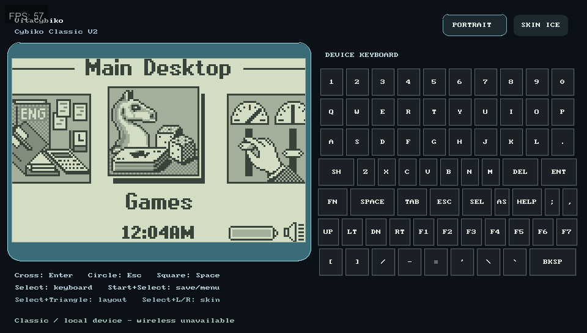
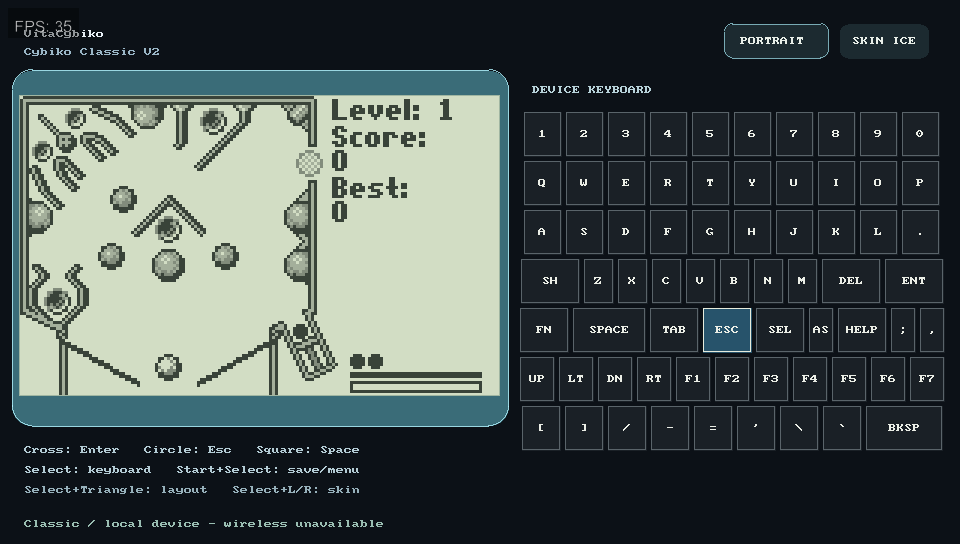
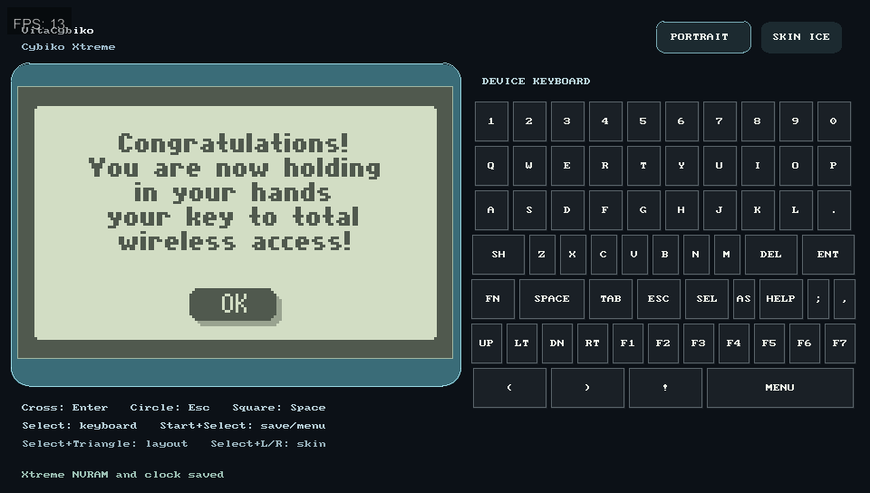
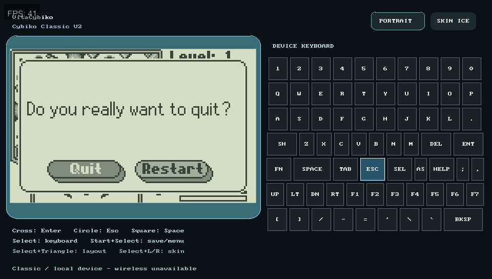
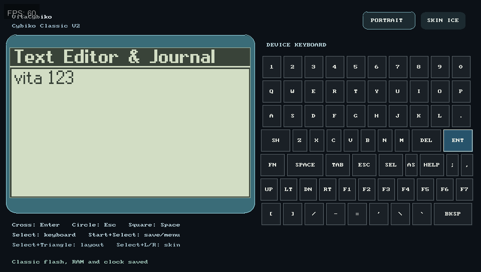
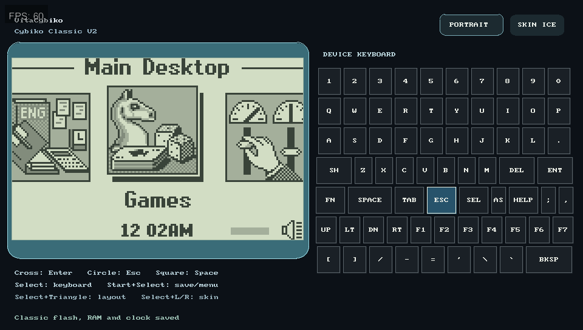
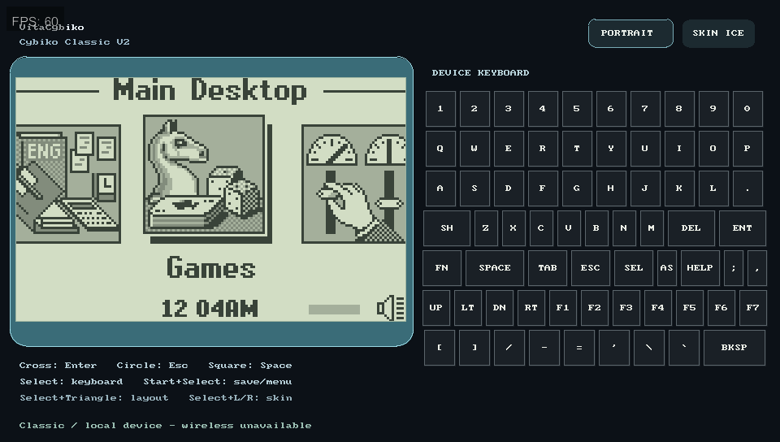
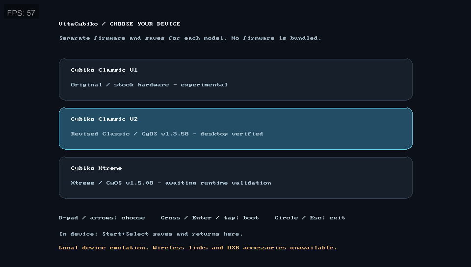
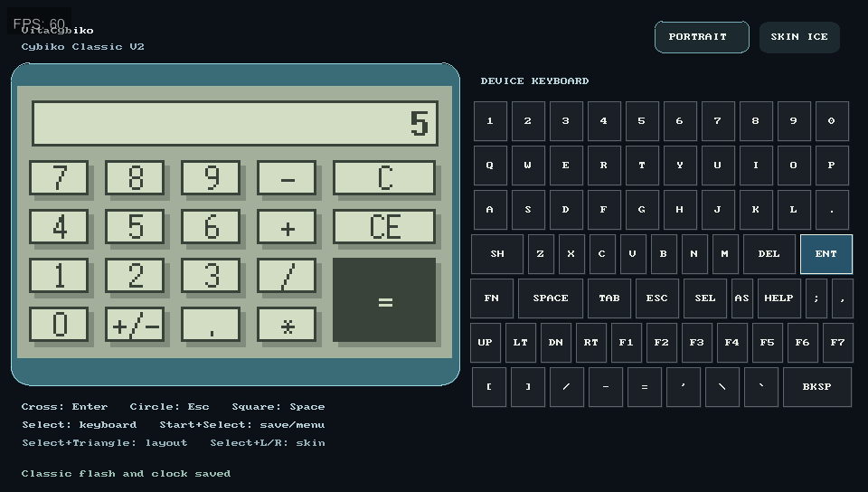

# Verification — 2026-09-19

## 01.13 workbench — not released or hardware-qualified

### Physical Vita deployment — execution pending

**Deployment preference:** The user subsequently requested full VPK delivery
for manual installation on every update because direct app-file replacements
did not refresh the LiveArea. Future physical updates must upload a clearly
versioned VPK for the user to install, not replace installed app files. Do not
equate an FTP upload with installation or runtime verification.

On the user's subsequent request to test on Vita, FTP at `10.0.0.202:1337`
was reachable. The installed executable matched 01.12
(`cf6b2ed2085fc6c2604db542fbada30113c1a73ecf9c2e65a0b94784566faf6c`).
All nine existing package files and the previous Classic V1 performance log
were retained under `/tmp/vitacybiko-physical-0113.DBO0Qm`.

Five changed package files were staged, read back, then renamed into place:
`eboot.bin`, `sce_sys/param.sfo`, and the LiveArea background, startup image and
template. Original changed files also remain beside their targets with suffix
`.vc0113-DBO0Qm.backup`. All nine resulting package files were downloaded and
compared byte-for-byte with the tested VPK. Installed executable SHA-256 is
`3ebf2deb8eb07d319f71e1ac254f204a5666dd1e2b3f2817a5bac59768ab3fd4`.
No saves, firmware, preferences or plugins were written.

This verifies deployment, **not execution**. The existing boot-stable taiHEN
configuration explicitly disables VitaCompanion and the remote-control plugins.
It was inspected read-only and left unchanged. The retained performance log is
still unchanged 01.12 evidence; a manual app launch is needed before fresh
physical 01.13 timing can be collected. No hardware smoothness pass is claimed.

The user then separately authorized restoring PSP/Adrenaline plugins. NoNpDrm
was already enabled. The installed Adrenaline kernel and NoPspEmuDrm kernel/user
modules were checked for nonempty SELF headers, and exactly those three entries
were restored to their prior sections (`*KERNEL`, `*KERNEL`, `*ALL`). All existing
active entries, including YAMT and PSVshellPlus, were preserved. The new config
was read back byte-for-byte; the previous config is retained on-device at
`ur0:tai/config.before-adrenaline-pDn5pa.txt` and locally under
`/tmp/vitacybiko-adrenaline-plugins.pDn5pa`. No reboot was performed, so neither
post-change boot stability nor loaded-plugin status has been verified. Remote
control plugins remain disabled.

### Latest menu-correction candidate

The corrected local-flow and periodic-row interpolation was tested in a separate
Windows Vita3K storage directory, then installed into the normal Windows app
directory. No Vita3K process was active at installation. The prior app is backed
up locally in `/tmp/vitacybiko-menu-correction-backup.n2Fe8h/app`; a sorted
SHA-256 manifest digest of every file found in the normal VitaCybiko data folder
was identical immediately before and after installation. Firmware, saves and
preferences were not overwritten. The normal app was then launched as Classic
V1 without scripted input, diagnostic allocation, or auto-exit and captured at
the You & Me desktop. It remains installed, not reverted to the older workbench.

```text
cd7a0093f1e7017e2e7664906c1bc97a079b65c9f005ee179fe602066e10275f  VitaCybiko.vpk
3ebf2deb8eb07d319f71e1ac254f204a5666dd1e2b3f2817a5bac59768ab3fd4  eboot.bin
```

Two isolated 60-second runs each saved 64 source/output records with zero
ARM/host pixel or motion-metadata mismatches. The second exercised both menu
directions and captured 340 passive window screenshots. See the
[paired-frame evidence and limitations](MENU-ARTIFACTS-01.13.md). These are
Windows Vita3K results, not physical-Vita performance qualification.

### Windows installation correction

After the earlier test cleanup, the user reported missing Vita3K input. Inspection
found that the restored pre-test Windows app was **01.02**, not 01.13 (installed
eboot SHA-256 `45fd818b706635556385e20b23d509ae0921f88d361f52c24fdd7ec860345df2`).
Restoring that old app had also rolled back newer input fixes. The running guest
was closed through its window, the old app/data were backed up, and only package
files were updated to the 01.13 workbench below. Data was compared byte-for-byte
before relaunch; no firmware, preferences, or saved-state files were replaced.

The updated app was left installed and running, not reverted again. Captured
desktop selection changed from You & Me to People during navigation; the user
was also actively navigating, so this is not an isolated automated-key test.
It is an actual Vita3K navigation observation, separate from host SDL tests and
not a claim about every controller or physical-Vita performance. The capture helper now honors its
`-Hold` argument for keyboard presses as well as mouse touches. The two frontend
input/event test groups also pass.

The subsequent passive 100-image sequence confirms unresolved icon tearing
during user navigation. See the [live artifact observations](MENU-ARTIFACTS-01.13.md)
and original captures. No app changes were made during that observation.

See [optimization evidence and unmet release gates](OPTIMIZATION-01.13.md).
Frontend and ASan/UBSan frontend-enabled suites pass 16/16, including ten
motion-interpolation cases, 23 frontend cases, and the trace decoder checks.
Real-firmware scheduler equivalence passes for Classic V1/V2 and Xtreme, and
the saved V1 full-battery/navigation test passes. The subsequent frontend-only
worker change passes the normal and ASan/UBSan suites, including a deliberately
stalled guest with concurrent UI rendering and short-tap input preservation.
The initially installed Windows workbench had these package hashes (not the
later isolated-validation candidate):

```text
af57853dd2b079dd8a9ecc4f36708f1e89198d5c0a98a34dead37c3a494d8055  VitaCybiko.vpk
4c2d06c21b55d1a39a5c73f814d7b391d24ea3d872159f801ccb46c269ad1b94  eboot.bin
```

The current motion-enabled ARM build booted in Windows Vita3K during a
60-second automated run; see the [actual desktop capture](vita3k-0113-motion-workbench.png).
The menu investigation fixed independent-region scrolling and odd-pixel matching
errors in interpolation, with regression tests. Native overlapping icon redraws
and general non-rigid interpolation remain limits under investigation. The
Windows trace still includes startup audio underruns. This does not establish
60 FPS guest animation, audio stability, or physical-Vita performance. No new
VPK was deployed to the physical device and no manual retest was requested.

## 01.12 candidate

See [01.12 changes and remaining limits](RELEASE-01.12.md).

- Core suite 13/13; host SDL frontend suite 14/14.
- 600-frame real-firmware scheduler equivalence checks passed for Classic V1,
  Classic V2 and Xtreme, including the new interrupt-deferral state.
- Current physical-Vita V1 save copied read-only: full-charge desktop navigation
  regression passed. The older snapshot also shows 100% and navigates from
  You & Me to E-Mail after 3,600 frames plus a Right press.
- Async checkpoint tests cover all profiles, independence from destroyed
  emulator state/changed model paths, CRC consistency, and write failure.
- Vita build completed and package metadata reports 01.12.

```text
2a4d00790084d5203212ff9241c8039c96c7ba64eb8b9a55dbc7624e1deabe7c  VitaCybiko.vpk
cf6b2ed2085fc6c2604db542fbada30113c1a73ecf9c2e65a0b94784566faf6c  eboot.bin
```

The first FTP deployment attempt failed before login with “No route to host”.
No 01.12 files were transferred in that attempt. After FTP became available,
01.12 was installed at `ux0:/app/VCYB00001/` and
`ux0:/VPK/VitaCybiko.vpk`. All nine installed package members and the complete
VPK were downloaded back and SHA-256 verified against the local release.
The previous nine app files and VPK were backed up locally before any upload,
in `/tmp/vitacybiko-0112-install-backup-efnjmuk4`; that directory also contains
the installed verification manifest. Firmware, saves, and plugins were untouched.

Subsequently, an existing 95-row physical-Vita 01.12 performance log was
retrieved without requesting another run. It confirms execution but **fails**
the smoothness/audio target: initial core work averages 39.55 ms/frame and
audio underruns remain. See [the newer workbench analysis](OPTIMIZATION-01.13.md).
Battery/input/game accuracy are not established by timing logs. The earlier
01.11 performance log is analyzed in [the investigation](INVESTIGATION-01.12.md).

## 01.11 candidate

01.10 was reported by the physical-Vita tester to still have low battery and
roughly 4–5 FPS during the loading transition. Its earlier entries below record
implementation and packaging checks, not successful resolution of those reports.

See [01.11 changes, regression evidence and timing diagnostics](RELEASE-01.11.md).
The VPK and Vita executable SHA-256 values are:

```text
92e93a38546915d15d68062ccdedf55a2f8a20aa687c10e3cb900f4e3ffd5feb  VitaCybiko.vpk
8a2ee0c6af325a7b53481c8135754d5638f0c5268007ae7d92d2c0d92a49772e  eboot.bin
```

The ZIP integrity check passed and package metadata reports 01.11. Physical
performance confirmation remains pending; do not describe this as verified
60 FPS or complete Cybiko compatibility.

FTP installation completed at `ux0:/app/VCYB00001/` and
`ux0:/VPK/VitaCybiko.vpk`. Every installed VPK member and the full VPK were
downloaded back and hash-checked. The previous app files were backed up locally;
firmware, saves, and plugin configuration were not modified.

## 01.10 physical Vita update

Vita package metadata is `01.10`. Candidate VPK SHA-256:

```text
430f9589409df4a2723fe952e98b57d1afe2a17d39cee7c5288614e02cb75eec
```

Executable payload SHA-256:

```text
634b9351b2c03675ae53335a5eab47ebe86245f20b3d9c241744b6aaacda649d
```

- Fixed Classic/Xtreme ADC byte reads to match the H8 ADC layout used by MAME:
  high byte is `sample >> 2`, low byte is `sample << 6`. This corrects the
  previous under-reported battery reading that still showed low battery in CyOS.
- ADC start writes now complete immediately by setting ADF and clearing ADST,
  so CyOS does not see a permanently busy converter.
- Vita emulation pacing now allows up to two bounded catch-up frames and skips
  intermediate LCD texture uploads during catch-up, reducing slow-motion during
  the CyOS swirl/menu transition without wasting GPU work on unpresented frames.
- Version and LiveArea art were bumped to `01.10`; LiveArea `content-rev` is
  now `10`.
- Local verification: regular host C suite passed 12/12, frontend-enabled host
  suite passed 13/13 with SDL dummy video/audio, the Vita build completed, the
  VPK passed ZIP integrity checks, and package metadata reports `01.10`.
- Classic V2 C4PC headless smoke test passed for 3600 frames using the supplied
  firmware/dataflash from `/mnt/e/cybiko/apps/c4pc`.
- The VPK was uploaded to the physical Vita at `ux0:/VPK/VitaCybiko.vpk`.
  The extracted app folder was also updated at `ux0:/app/VCYB00001/`; FTP
  readback verified the VPK, `eboot.bin`, `bg.png`, `startup.png`, and
  `template.xml` hashes.

Physical Vita behavior after the FTP update still requires user confirmation
for corrected battery display and smoother CyOS menu transition.

## 01.09 physical Vita update

Vita package metadata is `01.09`. Candidate VPK SHA-256:

```text
394d4843fbd0389b34663a58ce9875cbf8fca5d7840cef1c768f36d33de3eac3
```

Executable payload SHA-256:

```text
cb74c93e8e4101647f9a353273c61493d562ab3cb89f78f39c5f12f759b8cf49
```

- Rear touch is disabled through the native Vita touch API while front touch
  stays enabled.
- Classic battery ADC values now report a healthy channel spread so CyOS does
  not enter low/critical-power auto-shutdown. A core regression test covers the
  ADC values for Classic V1, Classic V2 and Xtreme.
- LiveArea `bg.png` and `startup.png` were replaced with VitaCybiko-branded art
  that includes version `01.09`; `content-rev` is now `9`.
- The launch/model-selection screen and in-emulator landscape header display
  `VitaCybiko v01.09`.
- Local verification: regular host C suite passed 12/12, frontend-enabled host
  suite passed 13/13 with SDL dummy video/audio, the Vita build completed, the
  VPK passed ZIP integrity checks, and package metadata reports `01.09`.
- The VPK was uploaded to the physical Vita at `ux0:/VPK/VitaCybiko.vpk`.
  The extracted app folder was also updated at `ux0:/app/VCYB00001/`; FTP
  readback verified the VPK, `eboot.bin`, `bg.png`, and `startup.png` hashes.

Physical Vita behavior after the FTP update still requires user confirmation
for rear-touch rejection, battery warning removal, and LiveArea cache refresh.

## v0.1.4-preview candidate

Vita package metadata is `01.04`. Candidate VPK SHA-256:

```text
cab5dbc068378b842af5f9a88fd66feee8763a882fd6ef986878f7d57620de2b
```

Executable payload SHA-256:

```text
5795eaf5dc03b1b4106ea34a603e961aaf63dc03feebacdf894893964fab24ce
```

- The Vita frontend now prefers a 48 kHz signed 16-bit stereo SDL audio device,
  with conversion from the core's 8-bit mono speaker samples. It falls back to
  the previous 8-bit mono path if S16 stereo cannot be opened.
- Queued audio now maintains one emulated frame of prebuffer and still caps
  backlog to four emulated frames. This is intended to reduce physical-Vita
  underrun crackle/choppiness without reintroducing long stale-audio lag.
- Local verification: regular host C suite passed 12/12, frontend-enabled host
  suite passed 13/13 with SDL dummy video/audio, and Python tests passed 7/7.
- The 01.04 VPK passed ZIP integrity checks, all VPK entries are stored, and
  package metadata reports `01.04`.
- The fixed VPK was uploaded to the physical Vita at
  `ux0:/VPK/VitaCybiko.vpk` and size-verified over FTP. The extracted app
  folder was also updated at `ux0:/app/VCYB00001/` with 9/9 files verified.

Audible quality on the physical Vita still requires user confirmation; this is
an audio pacing candidate, not a completed audio-accuracy claim.

## 01.16 preview candidate

Vita package metadata is `01.16`. Candidate VPK SHA-256:

```text
013373b31441d38285acdc42b9d7f3164fb4bdc92db3d9959bd3d7fbda88c24e
```

Executable SELF SHA-256:

```text
37b59e4a2981403706398f31778d536dc6f51982042d0186ff9e98f4986eb267
```

Raw linked executable SHA-256:

```text
25b71cae3a124d5d2267c7be4591a800811a853a4b4f26e021bb750ec90928ea
```

- Package metadata, LiveArea title and runtime UI now report `01.16`.
- The VPK contains 9 ZIP entries, all stored for VitaShell compatibility, and
  `zipfile.testzip()` reported no corrupt member.
- The GitHub `v0.1.16-preview` release asset was downloaded after publication;
  its SHA-256 matched the candidate VPK hash above, it still contained 9 stored
  ZIP entries, and `zipfile.testzip()` reported no corrupt member.
- A `SHA256SUMS` release asset was added and downloaded alongside
  `VitaCybiko.vpk`; `sha256sum -c SHA256SUMS` reported `VitaCybiko.vpk: OK`.
- The packaged `param.sfo` contains `VitaCybiko 01.16`, `01.16`, and title ID
  `VCYB00001`. `sce_sys/icon0.png`, `sce_sys/livearea/contents/bg.png`, and
  `sce_sys/livearea/contents/startup.png` are present.
- Local host verification passed all 16 default C/Python tests. The Vita VPK
  target built successfully with VitaSDK.
- Post-release CI on commit `1fca4da` passed the public
  [Host tests workflow](https://github.com/TheGh0stShip/VitaCybiko/actions/runs/35521286530):
  Release host build/tests and sanitizer/frontend host build/tests both
  completed successfully. This run followed a UBSan fix for H8S long INC/DEC
  and NEG arithmetic wraparound.
- The local Classic V2 600-frame firmware smoke passed with 599 active frames
  and reported semantic fast-path telemetry:
  `semantic_fast_blocks=220047`, `semantic_fast_cycles=556354`,
  `semantic_fast_rejects=229239`,
  `semantic_fast_cached_rejects=91655`, and
  `semantic_fast_backoff_skips=11731834`.
- The Vita `performance.csv` now includes per-window semantic fast-path deltas
  so physical Vita/Vita3K traces can distinguish CPU coverage, repeated
  reject/probe overhead, render/present cost, audio queue starvation and
  interpolation work.

This is not a completed 1:1 release. Physical Vita smoothness/audio, Xtreme
performance, Classic V1/Xtreme app coverage, the original launch bundle and
wireless/accessory behavior remain open.

## 01.17 preview candidate

Vita package metadata is `01.17`. Candidate VPK SHA-256:

```text
dccacfd58ae84abd1dba5c236d6710bff2339aeeaa665b972c689dd586b1676b
```

Executable SELF SHA-256:

```text
0cf6b6c1f48f98b9acae8020f8e14c8d60bb53c8dd90cd9bcdd1344b5354c356
```

Raw linked executable SHA-256:

```text
b06a0ee813d77bc450cf9a5fe40e9c9df578067e80668ec3e1cb11e3e83b8ed1
```

- Package metadata, LiveArea title and runtime UI report `01.17`.
- The VPK contains 9 ZIP entries, all stored for VitaShell compatibility, and
  `zipfile.testzip()` reported no corrupt member.
- The packaged `param.sfo` contains `VitaCybiko 01.17`, `01.17`, and title ID
  `VCYB00001`.
- This candidate includes the post-01.16 H8S arithmetic defined-behavior fix
  for long INC/DEC and NEG wraparound.
- Public CI on commit `1fca4da` passed the
  [Host tests workflow](https://github.com/TheGh0stShip/VitaCybiko/actions/runs/35521286530):
  Release host build/tests and sanitizer/frontend host build/tests both
  completed successfully.
- The published `v0.1.17-preview` release assets were downloaded after
  publication; `sha256sum -c SHA256SUMS` reported `VitaCybiko.vpk: OK`.
- Public tag CI on commit `40f1691` passed the
  [release workflow](https://github.com/TheGh0stShip/VitaCybiko/actions/runs/35521433978):
  Release host build/tests and sanitizer/frontend host build/tests both
  completed successfully.

## Post-01.17 Xtreme semantic branch fix

The worktree after `v0.1.17-preview` fixes the H8S semantic block resolver for
BHI/BLS branches so it matches the interpreter condition table. The previous
semantic resolver treated BHI as `!C` and BLS as `C`; the interpreter uses
`!C && !Z` and `C || Z`.

- `test_h8s_block` now covers BHI taken/fall-through and BLS
  taken/fall-through cases.
- `test_h8s_block`, `test_h8s_cpu`, and the full 16-test Release host suite
  pass.
- Local MAME-reference firmware smoke benchmark after the fix:
  Classic V1 `PASS`, 600 frames, 586 active, PC `219C8E`, 1.02 s wall;
  Classic V2 `PASS`, 600 frames, 596 active, PC `11ED98`, 0.39 s wall;
  Xtreme `PASS`, 600 frames, 600 active, PC `4A3C40`, 4.43 s wall.
- The Xtreme smoke was checked against a baseline without the fix and failed
  with unmapped `0xF00000` execution, 0 active frames and PC `FFFAD2`, so this
  is a real Xtreme correctness/boot-progress fix rather than a cosmetic timing
  change.

## v0.1.3-preview candidate

Vita package metadata is `01.03`. Candidate VPK SHA-256:

```text
794c25200c699fac3fa38a5bbff8325006f6f95cf4b2397ed66979f9481d2819
```

Executable payload SHA-256:

```text
cae04e9dee6e5cded235f371a1d23427b9d26e124905cba94cbf769f9c194459
```

- LiveArea PNGs were converted to Vita-safe indexed PNGs. The Vita build now
  runs `tools/repack_vpk_store.py` after `vita-pack-vpk`, so every VPK member is
  stored instead of deflated. The resulting archive passed `zipfile.testzip()`.
- Startup data-folder creation now uses recursive, stat-first directory
  creation and only prepares `ux0:data/VitaCybiko` before the model selector.
  Model-specific `roms/` and `apps/` folders are created after selection.
- The frontend-enabled host suite passes 13/13, including
  `runtime_dir_creation_on_prepared_storage`, using SDL's dummy video/audio
  drivers. The regular host suite passes 12/12 and Python tests pass 7/7.
- The fixed VPK was uploaded to the physical Vita at
  `ux0:/VPK/VitaCybiko.vpk` and size-verified over FTP. The extracted app
  folder was also updated at `ux0:/app/VCYB00001/` with 9/9 files verified, so
  an existing bubble should launch the fixed executable. Runtime data in
  `ux0:/data/VitaCybiko/` was rechecked with 28/28 files verified.
- Archive.org direct member links for all seven recognized firmware files were
  added to `docs/MODELS.md`; no firmware or save data is tracked in Git.

Physical Vita launch behavior after the FTP update still requires user
confirmation. This release fixes the reported install/data-folder blockers; it
does not claim completed physical-device compatibility.

## v0.1.2-preview candidate

Vita package metadata is `01.02`. Candidate VPK SHA-256:

```text
f375f58afa85b0ce39a70bb0b1ea0b346b6690ad9ce96f7b58570ed5dabc39aa
```

Executable payload SHA-256:

```text
45fd818b706635556385e20b23d509ae0921f88d361f52c24fdd7ec860345df2
```

- Timer scheduling was corrected so timers started by guest firmware tick within
  the same frame. A synthetic boot-ROM regression covers 8-bit and 16-bit timer
  starts for Classic V1, Classic V2 and Xtreme.
- The frontend now requests a smaller SDL audio device buffer, caps queued audio
  to four emulated frames and drops stale queued sound. A bounded catch-up path
  can advance up to two extra emulated frames before presenting when rendering
  falls behind, improving audio freshness during slow gameplay. This is not a
  full-speed guarantee.
- User-supplied MAME-reference firmware was staged only into local Vita3K data
  storage, not into the repository or VPK. The four newly staged images matched
  the reference CRC32/SHA-1 values for `cyrom112.bin`, `flash_v1246.bin`,
  `cyrom150.bin` and `cyos_v1508.bin`.
- Host smoke boots now reach the Classic V1 desktop and Xtreme setup with LCD
  activity and 480,000 generated audio samples over 600 frames:
  Classic V1 `pc=21EE36`, Xtreme `pc=4A3C40`.
- Windows Vita3K runtime captures from the actual installed 01.02 build show:
  Classic V1 stock desktop, Classic V2 desktop, Classic V2 Pinball gameplay and
  Xtreme first-run setup. Classic V1 and Xtreme are boot-verified, not yet
  app-by-app verified. Xtreme and V1 are noticeably slower than Classic V2.
- All 13 ASan/UBSan C suites and seven local Python tests passed after the
  audio/timer changes. The long ASan firmware smoke was cancelled because it was
  only a performance burden; the release host smoke was used for firmware boot
  screen evidence.









## v0.1.1-preview follow-up

Vita package metadata is now `01.01`. VPK SHA-256:

```text
a1da5712c3a856e1eb5df9fe4039a616be4401722c47d3fc682e598cb824d236
```

- Classic tap duration: a headless firmware run ignored a three-frame Esc press
  and recognized eight frames. The frontend now guarantees eight emulated
  frames for short Classic presses. In Windows Vita3K, 40 ms taps activate F4,
  open Pinball's quit dialog and confirm a return to Games.
- Text Editor: created `test.txt` with `vita 123`, accepted the guest save prompt,
  exited, saved, closed Vita3K, launched the updated build and reopened it intact.
- Clock: added the previously missing battery-backed Classic SRAM. A host run
  preserving both SRAM and RTC booted with the expected 2:00 AM time. Windows
  Vita3K showed 12:02 before a full process restart and 12:04 afterward, instead
  of resetting its displayed clock. No guest firmware bytes were patched.
- RAM sidecars validate model, size, header and payload CRCs and matching flash.
  Host tests cover atomic replacement, corrupt contents, wrong flash and wrong
  model, preserving original files and live RAM when validation fails.
- All 13 ASan/UBSan suites and seven local Python tests pass after these changes.
- [Release-commit GitHub CI](https://github.com/TheGh0stShip/VitaCybiko/actions/runs/35461016270)
  passes on a clean Ubuntu runner. The published VPK is available in the
  [v0.1.1-preview release](https://github.com/TheGh0stShip/VitaCybiko/releases/tag/v0.1.1-preview).
  Downloading that asset again reproduced the recorded SHA-256 and all nine ZIP
  entries passed integrity verification. Its executable matches the installed
  Windows Vita3K executable byte-for-byte.









These follow-up captures are actual Windows Vita3K client-window captures.
The older baseline below is retained as history; its clock-reset, short-tap and
Text Editor acceptance gaps are superseded by the results above. Alarm modes,
all-app coverage, physical Vita testing and full-speed gameplay remain open.

## v0.1.0-preview baseline artifact

Release preview `v0.1.0-preview`, title ID `VCYB00001` (Vita package metadata 01.00).

VPK SHA-256:

```text
24cd78ad5fb71d43f55588ec64c2fb9d40763c5215e21fc2bdc56b9008ea7c28
```

All nine ZIP entries passed integrity checks. Firmware and apps are not inside
the package; licenses and the literal-device LiveArea artwork are included.

Published at [v0.1.0-preview](https://github.com/TheGh0stShip/VitaCybiko/releases/tag/v0.1.0-preview).
The uploaded VPK was downloaded again, checked against the published SHA-256,
and passed ZIP integrity verification. The installed Windows Vita3K executable
matches the executable inside that package. Public
[release-commit CI](https://github.com/TheGh0stShip/VitaCybiko/actions/runs/35459876479)
passed on a clean Ubuntu runner.

## Real Windows Vita3K testing

Vita3K 0.2.1, build 4095-84184a36, OpenGL, 960×544. Tests were performed by
launching the actual VPK and operating its controls, not by substituting mock
screens. The emulator configuration was left unchanged.

| Test | Observed result |
| --- | --- |
| Three-model selector | Displays V1, V2 and Xtreme; selected model survives process restart |
| Classic V2 first boot | Welcome → date setup → synthetic nickname → Main Desktop |
| Subsequent boot | Returns to desktop without repeating first-run setup |
| Games / Pinball Pro | Game starts and renders gameplay; observed roughly 32–46 FPS in the optimized build before the v0.1.2 timing work; the v0.1.2 capture during play showed 17 FPS presentation in Vita3K |
| Applications / Calculator | Numeric input and directional button selection compute 2 + 3 = 5 |
| Save/model return | Start + Select saves and returns to the model menu |
| RTC storage | Versioned clock file is written; host round-trip checks pass, but guest desktop time discrepancies remain |
| Classic V1 / Xtreme | Superseded by v0.1.2: matching firmware staged and boot verified, but app coverage/performance remain open |

Desktop and Calculator generally showed about 60 FPS. The overlay is Vita3K's
reported presentation rate, **not** a measured cycle-accuracy or hardware-speed
benchmark. Pinball is not consistently full speed.






Desktop/selector/Pinball captures are from the final packaged build. Calculator
was tested on the preceding build (VPK SHA-256
`225772871e3ade2d4fd00eba50a60ac2dc3045465fb04731954661f05814a2a8`);
the final build also isolates Classic V2's Esc sense line and adds licenses.
Capture helper:
`tools/capture_vita3k.ps1` (explicit process ID and output path required).

## Automated checks

- 13 C test suites pass with AddressSanitizer, leak detection and UBSan.
- Actual SDL frontend tests cover input-source isolation, focus/background
  handling, rendering, model selection, storage failures, save preservation,
  clock corruption handling, preferences and layout switching.
- Core regressions cover the packed CCR/PC interrupt frame, RTE/TRAPA,
  long-displacement stores, instruction-memory mapping including self-modifying
  code, serial TX interrupts, RTC I2C/calendar, Classic profiles and DataFlash.
- A 1,200-frame run of the supplied Classic V2 firmware plus the test save passed
  ASan/UBSan; LCD activity was observed in 1,195 frames. This headless metric
  alone is not treated as boot proof.
- Seven Python tests pass locally. Three CD integration tests require private
  source media and skip in a clean public checkout; the other four use synthetic
  fixtures. Proprietary fixtures are deliberately not distributed.
- Firmware staging identifies all supplied model images by size/SHA-1, stages
  recognized V1/V2/Xtreme ROMs without overwriting existing saves and reports
  each missing profile individually.

## Open acceptance items

Physical Vita/PSTV testing; V1/Xtreme app coverage and performance; all
original launch-bundle apps; user-created Notes/Organizer data save-and-reopen;
reliable guest Esc/exit behavior across apps; audible fidelity; guest clock
correctness; sustained full-speed games; wireless/accessory interoperability.

The release remains a preview with the deepest app verification on Classic V2,
not completion of these items. See [compatibility](COMPATIBILITY.md) and
[release goals](RELEASE-PLAN.md).
